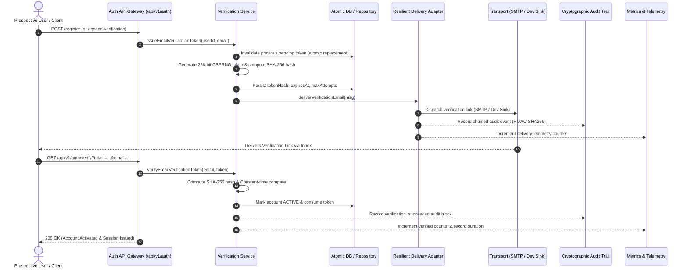

# BETA-005 :: Verification-Token Lifecycle & Pluggable Delivery Architecture

> **Workflow 1 — Identity, Access & Beta Foundation**  
> **Target Release Gate**: Phase 1 Foundation & Security Assurance  
> **Compliance & Audit**: Zero Plaintext Storage, OWASP ASVS v4.0 (Authentication & Cryptography)  
> **Primary Components**: `src/server/api/auth/`, `src/services/notifications/`, `src/routes/api/v1/auth/`

---

## 1. Executive Summary & Architectural Overview

Account verification is a foundational gate for the Stealth Mail ecosystem. To ensure uncompromised privacy, cryptographic isolation, and zero third-party vendor lock-in (such as proprietary email SaaS APIs), Stealth Mail provides a self-contained, high-assurance verification token lifecycle coupled with a pluggable notification delivery system.



---

## 2. Core Security Invariants & Cryptographic Controls

### 2.1 Zero Plaintext Storage & Memory Isolation

- **Token Generation**: Tokens are generated using cryptographically secure pseudorandom number generators (`crypto.getRandomValues`) providing 256 bits of entropy.
- **Non-Plaintext Storage**: Plaintext tokens are **NEVER** stored in any database, key-value store, cache, log stream, or audit record. Only the salted/canonical SHA-256 hash is persisted.
- **Ephemerality**: Plaintext token strings exist in memory only for the duration of the notification dispatch pipeline and are immediately discarded.

### 2.2 Constant-Time Timing Attack Mitigation

To eliminate side-channel timing attacks where an attacker infers token bytes through response duration variations:

- All token hash comparisons utilize `constantTimeCompare`, ensuring equal-time evaluation across valid and invalid token lengths and payloads.

### 2.3 Replacement & Replay Prevention Semantics

- **Atomic Replacement**: Requesting a resend generates a new token while atomically invalidating all prior unredeemed tokens for that account.
- **Single-Use Consumption**: Once a token is verified, its status in the persistence layer is atomically transitioned to `consumed`. Any subsequent verification attempt with the same token is rejected as `reused`.

### 2.4 Brute-Force & Denial-of-Service Defense

- **Attempt Capping**: Each token allows a maximum of 5 validation attempts (`maxAttempts`). Exceeding this limit permanently transitions the token into `brute_force_blocked`.
- **Rate Limiting**: IP addresses and recipient email addresses are governed by Token Bucket rate limiters (`TokenBucketRateLimiter`) with burst capacities and strict refill intervals.
- **Cooldown Windows**: Resend actions enforce a mandatory 60-second cooldown window to prevent email flooding.

---

## 3. Pluggable Delivery Architecture

The delivery subsystem is decoupled through the `NotificationAdapter` contract, supporting self-hosted enterprise infrastructure alongside local development isolation.

```
┌─────────────────────────────────────────────────────────────┐
│                 Notification Subsystem Architecture         │
├─────────────────────────────────────────────────────────────┤
│                                                             │
│   ┌─────────────────────────────────────────────────────┐   │
│   │        ResilientNotificationDeliveryService         │   │
│   │   (Circuit Breaker, Exponential Backoff, DLQ)       │   │
│   └──────────────────────────┬──────────────────────────┘   │
│                              │                              │
│              ┌───────────────┴───────────────┐              │
│              ▼                               ▼              │
│   ┌────────────────────┐          ┌────────────────────┐    │
│   │ SmtpNotification   │          │ SinkNotification   │    │
│   │      Adapter       │          │      Adapter       │    │
│   │ (Self-hosted SMTP) │          │ (In-memory / Dev)  │    │
│   └────────────────────┘          └────────────────────┘    │
│                                                             │
└─────────────────────────────────────────────────────────────┘
```

### 3.1 Transports

1. **Self-Hosted SMTP Adapter (`SmtpNotificationAdapter`)**: Connects directly to customer-managed or self-hosted SMTP relays with TLS certificate verification, connection timeouts, and authentication.
2. **Local Development Sink (`SinkNotificationAdapter`)**: In-memory ring buffer for local development and integration test verification; completely prevents external network emissions and is strictly forbidden in production.

### 3.2 Resilience & Reliability Controls

- **Circuit Breaker (`NotificationCircuitBreaker`)**: Automatically trips when 5 consecutive SMTP failures occur, halting network requests for 30 seconds before half-open probing.
- **Exponential Backoff with Jitter**: Retries transient transport failures up to 3 times with decorrelated jitter to avoid thundering-herd issues.
- **Dead-Letter Queue (`DeadLetterQueue`)**: Captures failed deliveries for operator inspection without leaking plaintext secret tokens.

---

## 4. Cryptographic Audit Trail & Telemetry

### 4.1 Audit Trail (`NotificationAuditTrail`)

Every notification lifecycle event (`dispatched`, `succeeded`, `failed`, `circuit_opened`) is appended to a sequentially chained, tamper-evident audit ledger using SHA-256 hash chaining:
$$\text{RecordHash}_n = \mathcal{H}(\text{Sequence}_n \parallel \text{EventType} \parallel \text{TargetRef} \parallel \text{RecordHash}_{n-1} \parallel \text{Timestamp})$$

Any unauthorized modification of historical records breaks the chain verification (`verifyChainIntegrity()`).

### 4.2 Telemetry & Observability (`VerificationTelemetryService`)

Provides Prometheus-compatible metric endpoints:

- `stealth_auth_tokens_issued_total`
- `stealth_auth_tokens_verified_total`
- `stealth_auth_tokens_expired_total`
- `stealth_auth_tokens_bruteforce_blocked_total`
- `stealth_auth_delivery_success_total`
- `stealth_auth_delivery_failed_total`
- `stealth_auth_pending_tokens_gauge`

---

## 5. Security & Verification Test Matrix

| Test Suite                                                   | Test Area                     | Coverage Objective                                                          | Result |
| :----------------------------------------------------------- | :---------------------------- | :-------------------------------------------------------------------------- | :----- |
| `tests/unit/api/verification-service.test.ts`                | Token Issuance & Verification | Expiry, atomic replacement, single-use replay, brute-force locking          | Passed |
| `tests/unit/api/verification-routes.test.ts`                 | Route Endpoints               | Input validation, error sanitization, generic responses                     | Passed |
| `tests/unit/notifications/verification-delivery-ops.test.ts` | Notification Ops              | SMTP & sink delivery pipelines, header isolation                            | Passed |
| `tests/unit/notifications/notification-audit-trail.test.ts`  | Audit Integrity               | Cryptographic hash chaining, tamper detection                               | Passed |
| `tests/unit/notifications/notification-resilience.test.ts`   | Resilience Engine             | Circuit breaker tripping, backoff retries, DLQ quarantine                   | Passed |
| `tests/unit/api/verification-security-hardening.test.ts`     | Security Defenses             | Constant-time comparison, token bucket rate limiter, disposable email check | Passed |
| `tests/unit/api/verification-advanced-lifecycle.test.ts`     | End-to-End Integration        | Full verification flow with telemetry and security controls                 | Passed |
